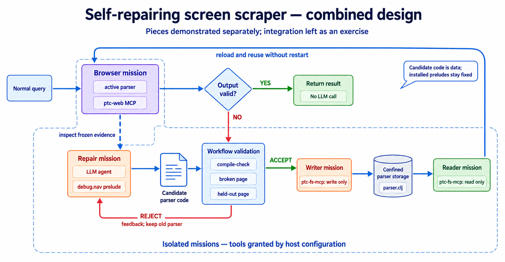
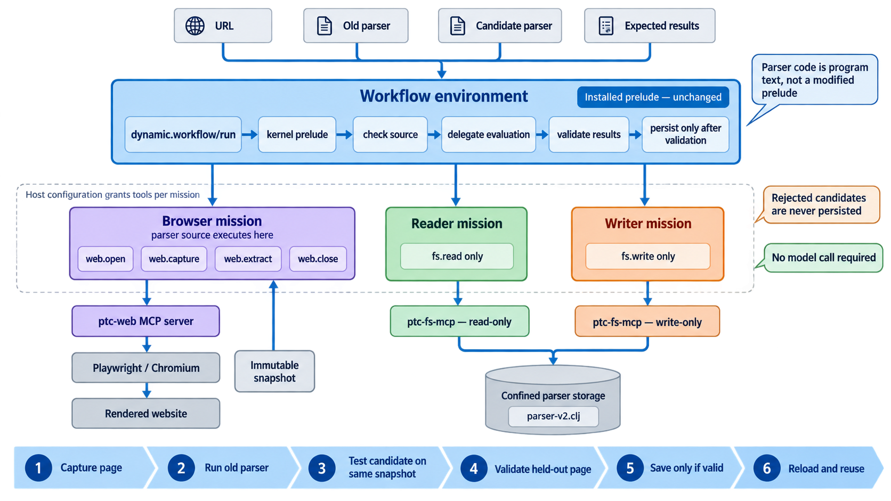

# Change parser code without restarting PTC Runner

## The complete idea

The examples in this repository demonstrate the pieces of a self-repairing
screen scraper:

- [Site learning](../site-learning/README.md) uses an LLM to learn selectors and
  build an extraction component.
- [Repair loop](../repair-loop/README.md) calls an LLM only when an existing
  extractor fails, then tests the proposed replacement.
- This example shows how new parser code can be saved, reloaded, and used
  without restarting PTC Runner.

Combined, a normal query would use no LLM. If its output failed validation, a
repair mission would inspect the failure and propose parser code. The workflow
would test that code on the broken page and a held-out page, save it only when
both pass, and then reload it for later queries.



All these parts are tested separately. Connecting them into this exact flow is
left as an exercise. 🙂

## Why this example exists

Browser extraction often uses either a fixed parser, which is fast but breaks
when the page changes, or an LLM on every request, which is slower and harder to
control. These examples explore a third option: keep normal queries
deterministic, call an LLM only after a detected failure, turn its small proposal
into ordinary parser code, and promote that code only after independent checks.

The interesting part is the boundary around the model. It can inspect bounded,
read-only evidence and propose selectors, but it cannot save or approve its own
repair. The accepted parser then runs without an LLM. This makes the result
reusable and gives the workflow an auditable place to reject a bad suggestion.
The [repair transcript walkthrough](../repair-loop/debug-turns.md) shows what the
model reads and generates in the related repair experiment.

Automatic selector repair and LLM-generated scrapers are not new by themselves.
This example is about combining those ideas with small capabilities, immutable
evidence, and model-free validation. It is still a toy problem: the pages are
synthetic, the expected records are known exactly, and the layout changes are
simple. Real sites add authentication, interaction, pagination, generated class
names, ambiguous data, and cases where no reliable held-out answer exists. The
example demonstrates an architecture, not proof that arbitrary scrapers can
repair themselves safely.

## The runnable example

The example in this directory starts with two supplied parsers, so it makes no
model calls. It tests, saves, and reuses the accepted parser while PTC Runner is
still running.

PTC Runner separates work into two kinds of environments:

- The **workflow** is the coordinator. It decides what to run and checks the
  results.
- A **mission** is an isolated worker with only the tools it needs. The browser
  mission can use `ptc-web`, the reader can read files, and the writer can write
  files.

A **prelude** is trusted helper code installed before the run. The workflow uses
the fixed `kernel` prelude to check and execute parser code. The parser itself is
just program text passed to a mission; replacing it does not change the prelude
or the workflow.

**MCP servers** are separate programs that provide tools. `ptc-web` provides
browser tools through Playwright. Two restricted `ptc-fs-mcp` instances provide
read-only and write-only access to the same parser directory.



## What happens

1. The browser mission captures a rendered page.
2. It runs the old parser and then a candidate parser on the same snapshot.
3. The workflow also checks the candidate on a held-out page.
4. The writer mission saves only a candidate that passes both checks.
5. The reader mission loads the saved parser, and the browser mission runs it
   again without restarting PTC Runner.

The browser mission cannot write files, rejected parsers are never saved, and
the example makes no model calls.

## Run it

Build `ptc-web` and `ptc-fs-mcp`, install Playwright Chromium, and put `ptc` on
your PATH. Then run from the `ptc-web` checkout:

```sh
pnpm run test:dynamic-parser -- ../ptc-fs-mcp/dist/cli.js
```

The filesystem CLI argument is optional when the sibling checkout shown above
exists. You can also set `PTC_FS_MCP_CLI` to another built `ptc-fs-mcp` CLI.
